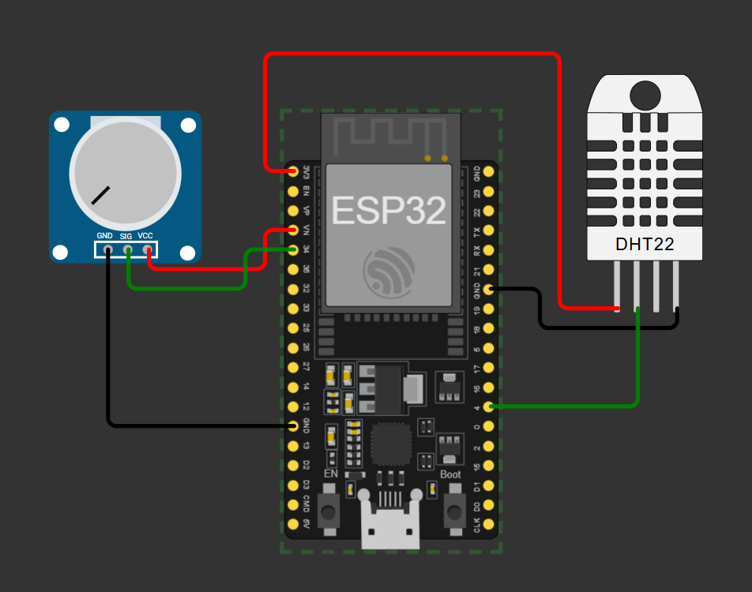
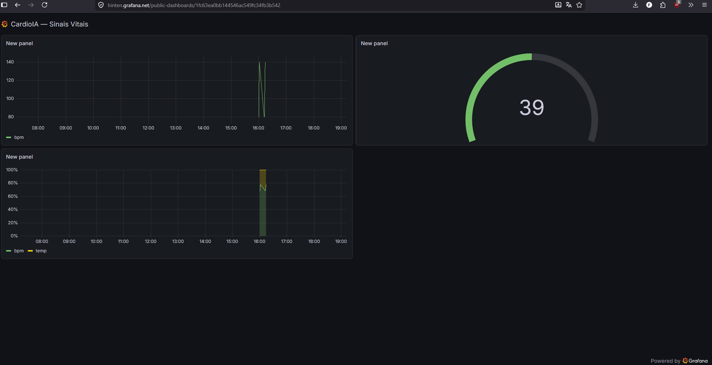

# FIAP - Faculdade de Informática e Administração Paulista

<p align="center">
<a href="https://www.fiap.com.br/"></a>
</p>

<br>

# CardioIA — Monitoramento Contínuo IoT na Saúde

## Fase 3, Cap. 1

## 👨‍🎓 Integrantes:
- <a href="#">Alice C. M. Assis</a> — RM 566233
- <a href="#">Leonardo S. Souza</a> — RM 563928
- <a href="#">Lucas B. Francelino</a> — RM 561409
- <a href="#">Pedro L. T. Silva</a> — RM 561644
- <a href="#">Vitor A. Bezerra</a> — RM 563001

## 👩‍🏫 Professores:
### Tutor(a)
- <a href="#">Nome do Tutor</a>
### Coordenador(a)
- <a href="#">Nome do Coordenador</a>

## 📜 Descrição

CardioIA é um protótipo de vestível IoT para monitoramento contínuo de pacientes cardiológicos, desenvolvido como projeto da Fase 3 da FIAP. O sistema demonstra o ciclo completo de Edge → Fog → Cloud Computing aplicado à saúde digital.

O **ESP32 simulado no Wokwi** captura sinais vitais por dois sensores: o **DHT22** (temperatura e umidade) e um **botão** que simula batimentos cardíacos — cada toque equivale a uma batida, e o BPM é calculado em janelas de 5 segundos. Quando a conexão cai, as leituras são guardadas em um **buffer circular de 100 amostras** (~8 minutos) diretamente na RAM do ESP32, sem depender de SPIFFS. Ao reconectar, os dados são sincronizados automaticamente para a nuvem.

A transmissão é feita via **MQTT com TLS** (porta 8883) para o **HiveMQ Cloud**, em formato JSON com campos de temperatura, umidade, BPM, timestamp e uma flag que distingue leituras ao vivo de leituras recuperadas do buffer. O **dashboard Node-RED** consome esses dados em tempo real e exibe gráfico de BPM, gauge de temperatura e alertas automáticos para taquicardia (BPM > 120) e febre (temp > 38 °C). Como bônus, o projeto integra **Grafana Cloud** via InfluxDB para visualização avançada com histórico.

Duas extensões opcionais ("Ir Além") foram implementadas: um cliente Python que consome uma API REST e dispara alertas por e-mail; e um notebook Jupyter que compara regressão logística com uma rede neural neuromórfica (modelo LIF) em séries temporais de ECG do dataset MIT-BIH.

## 📁 Estrutura de pastas

- <b>firmware/</b> — Código ESP32 em C++ (PlatformIO/Arduino). Contém `main.cpp` (sensores + buffer offline), `cloud_link.cpp` (Wi-Fi + MQTT/TLS) e `cloud_link.h` (interface entre as partes).
- <b>node-red/</b> — Arquivo `flows.json` exportado com o dashboard completo (chart + gauge + alerta). Importar diretamente no editor Node-RED.
- <b>scripts/</b> — `mock_publisher.py`: publica telemetria simulada no broker sem precisar do ESP32. Útil para testar o dashboard de forma isolada.
- <b>ir_alem_1/</b> — Extensão bônus: servidor Flask com cliente REST e automação de alertas por e-mail.
- <b>ir_alem_2/</b> — Extensão bônus: notebook Jupyter com análise de ECG e comparação entre regressão logística e rede neuromórfica (LIF).
- <b>docs/</b> — Relatórios técnicos da atividade: `parte1_relatorio.md` (Edge Computing) e `parte2_relatorio.md` (MQTT + Dashboard).
- <b>assets/</b> — Imagens e capturas de tela (circuito Wokwi, dashboard Grafana).
- <b>README.md</b> — Este arquivo.

## 📄 Relatórios entregáveis

| Relatório | Parte | Conteúdo |
|-----------|-------|---------|
| [Parte 1 — Edge Computing](docs/parte1_relatorio.md) | Obrigatório | Fluxo de funcionamento, sensores, buffer offline e lógica de resiliência |
| [Parte 2 — MQTT e Dashboard](docs/parte2_relatorio.md) | Obrigatório | Fluxo de comunicação MQTT, configuração do Node-RED e alertas |

## 📸 Demonstração

### Circuito no Wokwi (ESP32 + DHT22 + Botão)


### Dashboard Grafana Cloud (bônus)
[](https://hinten.grafana.net/public-dashboards/1fc63ea0bb144546ac549fc34fb3b542)

## 🔧 Como executar o código

### Pré-requisitos
- [PlatformIO](https://platformio.org/) para compilar o firmware
- [Node.js + Node-RED](https://nodered.org/docs/getting-started/local) para o dashboard
- Python 3.10+ com `pip` para o mock publisher e extensões opcionais
- Conta gratuita no [HiveMQ Cloud](https://www.hivemq.com/mqtt-cloud-broker/) (broker MQTT)

### 1. Firmware — ESP32 no Wokwi

```powershell
cd firmware
copy include\secrets.h.example include\secrets.h
# Editar secrets.h: WIFI_SSID, MQTT_HOST, MQTT_USER, MQTT_PASSWORD, DEVICE_ID
pio run -e esp32dev
```

Abrir o **[projeto no Wokwi](https://wokwi.com/projects/463837603097937921)**, pressionar **Play ▶️** e acompanhar as leituras no Serial Monitor.

Detalhes de setup, diagrama de circuito e troubleshooting em [`firmware/README.md`](firmware/README.md).

### 2. Dashboard Node-RED

```powershell
npm install -g --unsafe-perm node-red
node-red
```

1. Acessar `http://127.0.0.1:1880` (editor)
2. Instalar `node-red-dashboard` em **Manage Palette → Install**
3. Importar `node-red/flows.json`
4. No nó MQTT, configurar host e credenciais HiveMQ e fazer **Deploy**
5. Abrir o dashboard em `http://127.0.0.1:1880/ui`

### 3. Testes sem ESP32 (mock publisher)

```powershell
cd scripts
copy .env.example .env
# Editar .env com as mesmas credenciais HiveMQ
pip install -r requirements.txt
python mock_publisher.py --scenario normal --duration 30
```

Cenários disponíveis: `normal`, `taquicardia`, `febre`, `tudo`, `offline-flush`, `ruido`.

### 4. (Opcional) Ir Além 1 — REST API + e-mail

Ver instruções em [`ir_alem_1/README.md`](ir_alem_1/README.md).

### 5. (Opcional) Ir Além 2 — Notebook IA

```powershell
cd ir_alem_2
pip install -r requirements.txt
jupyter notebook cardioia_ir_alem2.ipynb
```

Ver detalhes em [`ir_alem_2/README.md`](ir_alem_2/README.md).

---

## 📜 Vídeo

## [Clique aqui](https://youtu.be/-ZB9HGTCSXg) para ver o vídeo explicando o projeto.

<p align="center">
  
</p>

---

## 🗃 Histórico de lançamentos

* 0.3.0 — 12/05/2026
    * Ir Além 1: cliente REST + alertas por e-mail (Python/Flask)
    * Ir Além 2: notebook LR × LIF neuromórfico (dataset MIT-BIH)
* 0.2.0 — 09/05/2026
    * Parte 2: MQTT/TLS + HiveMQ Cloud + Dashboard Node-RED + Grafana (bônus)
* 0.1.0 — 05/05/2026
    * Parte 1: sensores DHT22 + BPM, buffer offline 100 amostras, sincronização automática

## 📋 Licença

<p xmlns:cc="http://creativecommons.org/ns#" xmlns:dct="http://purl.org/dc/terms/"><a property="dct:title" rel="cc:attributionURL" href="https://github.com/agodoi/template">MODELO GIT FIAP</a> por <a rel="cc:attributionURL dct:creator" property="cc:attributionName" href="https://fiap.com.br">Fiap</a> está licenciado sobre <a href="http://creativecommons.org/licenses/by/4.0/?ref=chooser-v1" target="_blank" rel="license noopener noreferrer" style="display:inline-block;">Attribution 4.0 International</a>.</p>
